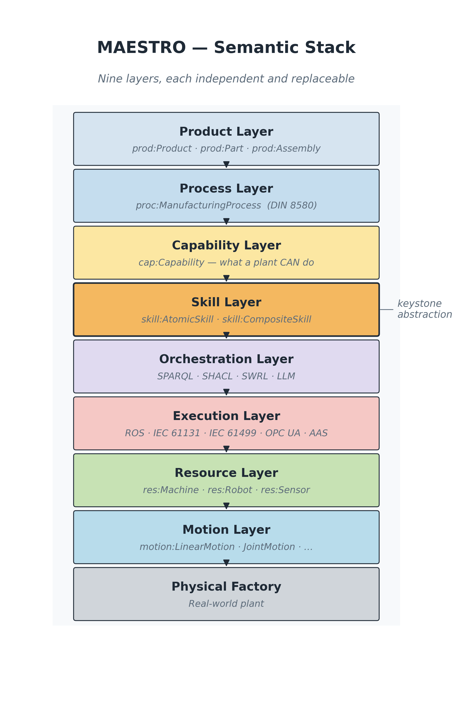
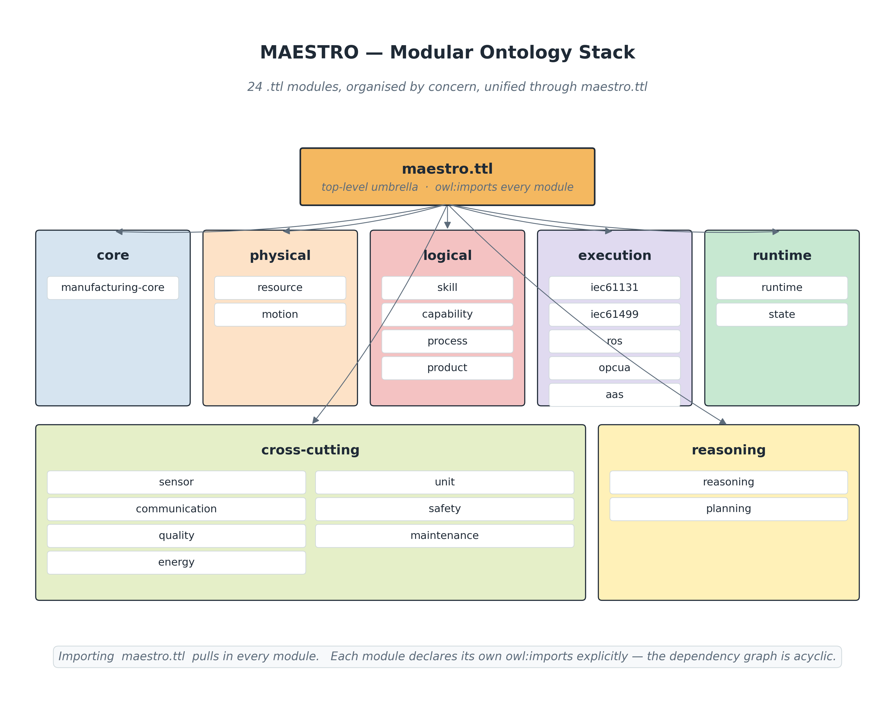
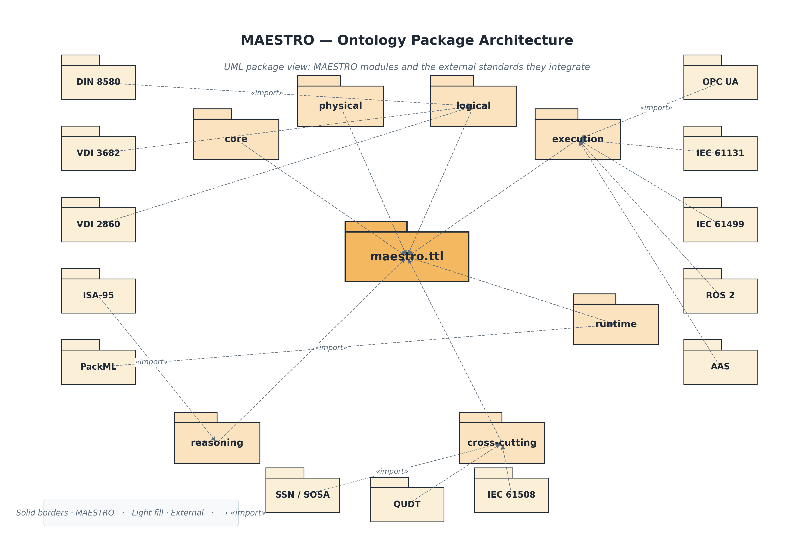
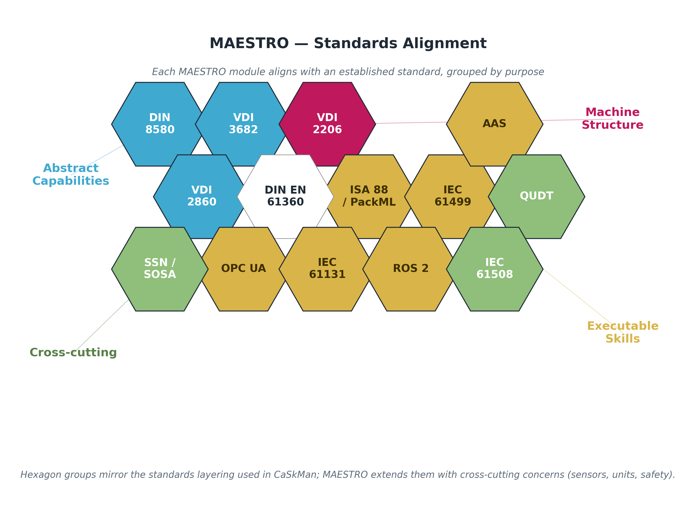
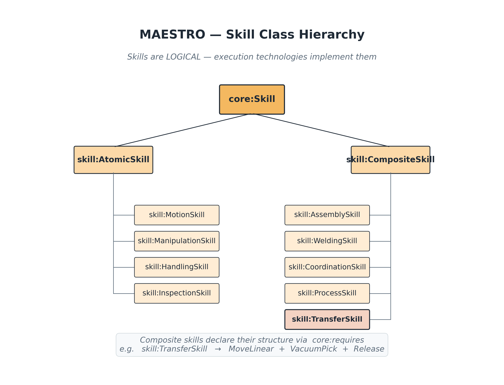
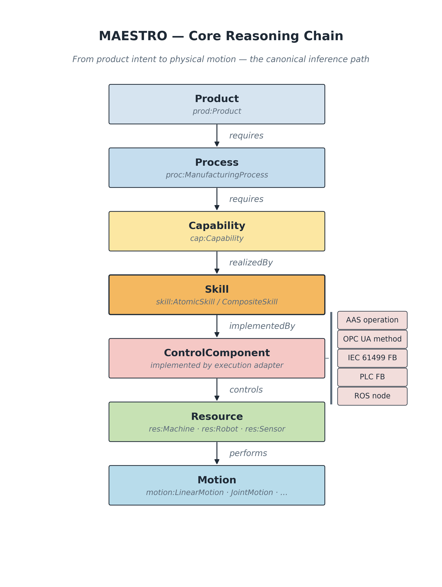
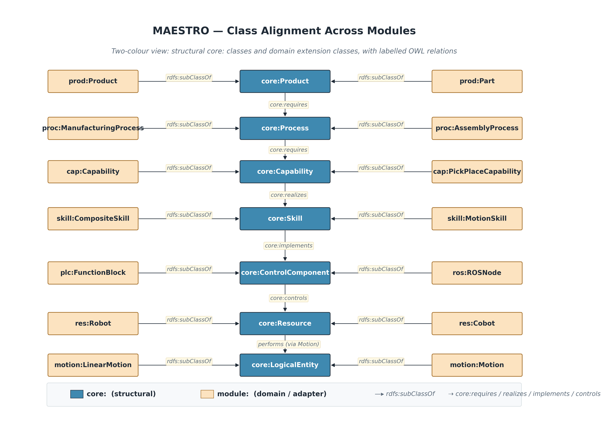
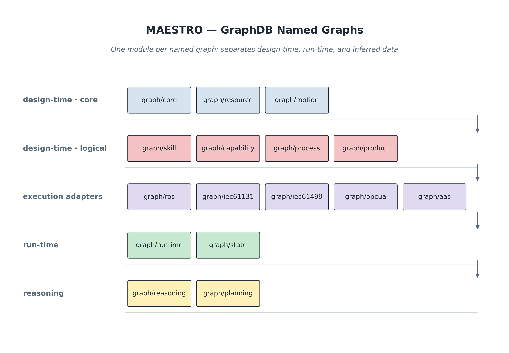
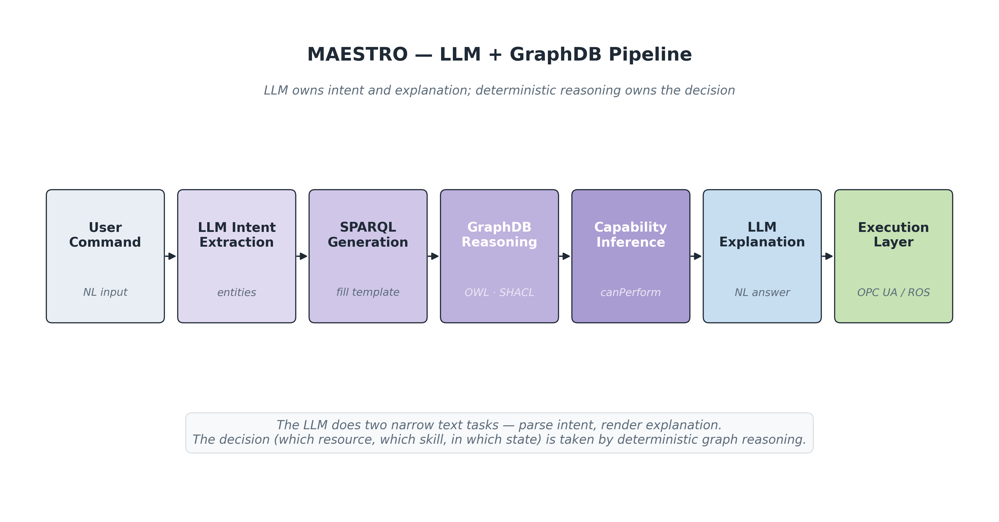
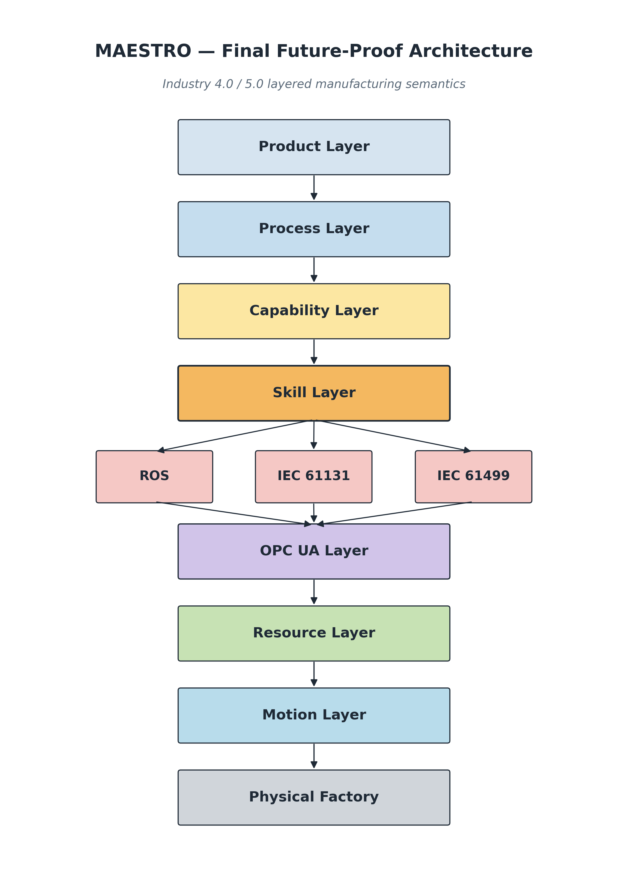

# MAESTRO

**Modular Ontology Stack for Future-Proof Manufacturing**
*Industry 4.0 / Industry 5.0 — semantic, skill-based, vendor-independent*

[](LICENSE)
[](CHANGELOG.md)
[](https://www.w3.org/TR/owl2-overview/)

MAESTRO is a unified, standards-aligned semantic framework for modelling
manufacturing systems. It separates **what a plant can do** (capability) from
**how a plant does it** (skill) and **what executes it** (ROS / IEC 61131 /
IEC 61499 / OPC UA), so that multi-vendor automation, digital twins, and
AI orchestration can share one knowledge graph.

It is heavily inspired by — and designed to interoperate with — the
[CaSkade-Automation/CaSkMan](https://github.com/CaSkade-Automation/CaSkMan)
ontology, which is preserved under [`references/caskman.ttl`](references/caskman.ttl).

---

## Table of Contents

1. [Core Philosophy](#1-core-philosophy)
2. [Master Architecture](#2-master-architecture)
3. [Complete Modular Ontology Stack](#3-complete-modular-ontology-stack)
4. [Standard Alignment](#4-standard-alignment)
5. [Core Ontology Design](#5-core-ontology-design)
6. [Resource Ontology](#6-resource-ontology)
7. [Motion Ontology](#7-motion-ontology)
8. [Skill Ontology](#8-skill-ontology)
9. [Capability Ontology](#9-capability-ontology)
10. [Process Ontology](#10-process-ontology)
11. [Product Ontology](#11-product-ontology)
12. [ROS Ontology](#12-ros-ontology)
13. [IEC 61131 Ontology](#13-iec-61131-ontology)
14. [IEC 61499 Ontology](#14-iec-61499-ontology)
15. [OPC UA Ontology](#15-opc-ua-ontology)
16. [AAS Ontology](#16-aas-ontology)
17. [Runtime Ontology](#17-runtime-ontology)
18. [Reasoning Architecture](#18-reasoning-architecture)
19. [Core Reasoning Model](#19-core-reasoning-model)
20. [Example Inference Rules](#20-example-inference-rules)
21. [GraphDB Organization](#21-graphdb-organization)
22. [LLM + GraphDB Architecture](#22-llm--graphdb-architecture)
23. [Future Industry 5.0 Extensions](#23-future-industry-50-extensions)
24. [Final Design Principles](#24-final-design-principles)
25. [Final Future-Proof Architecture](#25-final-future-proof-architecture)

Additional pages:
[Repository Layout](#repository-layout) ·
[Quick Start](#quick-start) ·
[Examples](examples/README.md) ·
[Competency Questions](docs/competency-questions.md) ·
[Docs](docs/) ·
[Citation](#citation) ·
[License](#license)

---

## 1. Core Philosophy

Traditional manufacturing systems model:

```
Machine → Function
```

Future factories must model:

```
Capability
    realized by Skill
        executed by Control System
            controlling Resource
```

This abstraction allows ROS robots, PLCs, IEC 61499 systems, OPC UA devices,
AI agents, and digital twins to operate together semantically.

See [docs/01-philosophy.md](docs/01-philosophy.md).

---

## 2. Master Architecture

The MAESTRO semantic stack — nine layers, each independent and replaceable:



```
┌───────────────────────────────┐
│ Product Layer                 │
├───────────────────────────────┤
│ Process Layer                 │
├───────────────────────────────┤
│ Capability Layer              │
├───────────────────────────────┤
│ Skill Layer                   │
├───────────────────────────────┤
│ Orchestration Layer           │
├───────────────────────────────┤
│ Execution Layer               │
├───────────────────────────────┤
│ Resource Layer                │
├───────────────────────────────┤
│ Motion Layer                  │
├───────────────────────────────┤
│ Physical Factory              │
└───────────────────────────────┘
```

See [docs/02-master-architecture.md](docs/02-master-architecture.md).

---

## 3. Complete Modular Ontology Stack



The same architecture viewed as a **UML package diagram** with `«import»`
arrows to the external standards each module aligns with:



| File | Purpose |
|---|---|
| [`ontologies/core/manufacturing-core.ttl`](ontologies/core/manufacturing-core.ttl) | Root abstractions (Entity, Resource, Skill, Capability, …) |
| [`ontologies/physical/resource.ttl`](ontologies/physical/resource.ttl) | Machines, robots, PLCs, sensors |
| [`ontologies/physical/motion.ttl`](ontologies/physical/motion.ttl) | Motion semantics |
| [`ontologies/logical/skill.ttl`](ontologies/logical/skill.ttl) | Atomic + composite skill hierarchy |
| [`ontologies/logical/capability.ttl`](ontologies/logical/capability.ttl) | Manufacturing capabilities |
| [`ontologies/logical/process.ttl`](ontologies/logical/process.ttl) | DIN 8580 / VDI 3682 processes |
| [`ontologies/logical/product.ttl`](ontologies/logical/product.ttl) | Products, parts, tolerances |
| [`ontologies/execution/iec61131.ttl`](ontologies/execution/iec61131.ttl) | PLC semantics |
| [`ontologies/execution/iec61499.ttl`](ontologies/execution/iec61499.ttl) | Event-driven distributed FBs |
| [`ontologies/execution/ros.ttl`](ontologies/execution/ros.ttl) | ROS / ROS 2 nodes, topics, actions |
| [`ontologies/execution/opcua.ttl`](ontologies/execution/opcua.ttl) | OPC UA skill interfaces |
| [`ontologies/execution/aas.ttl`](ontologies/execution/aas.ttl) | Asset Administration Shell |
| [`ontologies/runtime/runtime.ttl`](ontologies/runtime/runtime.ttl) | Live operational state (PackML) |
| [`ontologies/runtime/state.ttl`](ontologies/runtime/state.ttl) | Generic state machine vocab |
| [`ontologies/cross-cutting/sensor.ttl`](ontologies/cross-cutting/sensor.ttl) | SSN / SOSA sensor model |
| [`ontologies/cross-cutting/unit.ttl`](ontologies/cross-cutting/unit.ttl) | QUDT-aligned units |
| [`ontologies/cross-cutting/communication.ttl`](ontologies/cross-cutting/communication.ttl) | DDS / MQTT / OPC UA transport |
| [`ontologies/cross-cutting/safety.ttl`](ontologies/cross-cutting/safety.ttl) | IEC 61508 safety |
| [`ontologies/cross-cutting/quality.ttl`](ontologies/cross-cutting/quality.ttl) | ISO 9001 quality |
| [`ontologies/cross-cutting/maintenance.ttl`](ontologies/cross-cutting/maintenance.ttl) | Maintenance & predictive |
| [`ontologies/cross-cutting/energy.ttl`](ontologies/cross-cutting/energy.ttl) | Energy-aware manufacturing |
| [`ontologies/reasoning/reasoning.ttl`](ontologies/reasoning/reasoning.ttl) | Reasoning model documentation |
| [`ontologies/reasoning/planning.ttl`](ontologies/reasoning/planning.ttl) | ISA-95 production planning |
| [`ontologies/maestro.ttl`](ontologies/maestro.ttl) | **Top-level umbrella** — imports every module |

See [docs/03-modular-stack.md](docs/03-modular-stack.md).

---

## 4. Standard Alignment



| Ontology | Standard |
|---|---|
| `iec61131.ttl` | IEC 61131 |
| `iec61499.ttl` | IEC 61499 |
| `opcua.ttl` | OPC UA |
| `aas.ttl` | Asset Administration Shell |
| `sensor.ttl` | SSN / SOSA |
| `unit.ttl` | QUDT |
| `process.ttl` | DIN 8580 / VDI 3682 |
| `skill.ttl` | VDI 2860 |
| `runtime.ttl` | PackML |
| `planning.ttl` | ISA-95 |
| `communication.ttl` | DDS / MQTT |
| `ros.ttl` | ROS 2 |
| `quality.ttl` | ISO 9001 |
| `safety.ttl` | IEC 61508 |

See [docs/04-standard-alignment.md](docs/04-standard-alignment.md).

---

## 5. Core Ontology Design

The ROOT ontology ([`manufacturing-core.ttl`](ontologies/core/manufacturing-core.ttl))
contains only universal abstractions — every other module imports from here.

**Classes**

```turtle
core:Entity
core:PhysicalEntity
core:LogicalEntity
core:Resource
core:Skill
core:Capability
core:Process
core:Product
core:State
core:Event
core:Constraint
core:ControlComponent
core:Plant
```

**Universal properties**

```turtle
core:requires          # deprecated generic parent
core:requiresCapability
core:realizedBySkill
core:composedOfSkill
core:requiresMotion
core:provides
core:implements
core:executes
core:controls
core:realizes
core:deployedOn
core:hasState
core:dependsOn
core:hasPart
core:connectedTo
core:communicatesThrough
core:canPerform
core:canManufacture
core:hasPlantCapability
```

See [docs/05-core-ontology.md](docs/05-core-ontology.md).

---

## 6. Resource Ontology

[`resource.ttl`](ontologies/physical/resource.ttl) represents all physical
manufacturing assets — machines, robots, sensors, actuators.

> **Rule.** Resources DO NOT contain manufacturing semantics. They only
> *provide* skills, *support* motion, and *expose* interfaces.

See [docs/06-resource-ontology.md](docs/06-resource-ontology.md).

---

## 7. Motion Ontology

[`motion.ttl`](ontologies/physical/motion.ttl) represents machine-independent
motion semantics: linear, rotational, joint, Cartesian, synchronized,
trajectory, and force-controlled motion.

> **Important.** Motion MUST remain independent from ROS, PLCs, and IEC 61499.

See [docs/07-motion-ontology.md](docs/07-motion-ontology.md).

---

## 8. Skill Ontology

This is the **most important** module. Modern manufacturing is moving toward
**skill-based manufacturing**, and skills are the keystone abstraction here.



```
Skill
├── AtomicSkill
├── CompositeSkill
├── MotionSkill
├── ManipulationSkill
├── AssemblySkill
├── WeldingSkill
├── InspectionSkill
├── HandlingSkill
├── CoordinationSkill
└── ProcessSkill
```

Example:

```turtle
skill:MoveLinear   a skill:MotionSkill ;
    skill:requiresMotion motion:LinearMotionSpec .

skill:VacuumPick   a skill:ManipulationSkill .

skill:Transfer     a skill:TransferSkill ;
    skill:composedOfSkill skill:MoveLinear ;
    skill:composedOfSkill skill:VacuumPick ;
    skill:composedOfSkill skill:Release .
```

> **Critical.** Skills are LOGICAL. They are NOT ROS nodes, PLC FBs, or
> IEC 61499 FBs. Execution technologies *implement* skills.

See [docs/08-skill-ontology.md](docs/08-skill-ontology.md).

---

## 9. Capability Ontology

[`capability.ttl`](ontologies/logical/capability.ttl) represents manufacturing
*possibility* — the high-level things a plant can do.

✅ Good: `TransportCapability`
❌ Bad:  `MoveCylinderLeftCapability`

See [docs/09-capability-ontology.md](docs/09-capability-ontology.md).

---

## 10. Process Ontology

[`process.ttl`](ontologies/logical/process.ttl) represents manufacturing logic
aligned with DIN 8580 (manufacturing process taxonomy) and VDI 3682
(process descriptions).

See [docs/10-process-ontology.md](docs/10-process-ontology.md).

---

## 11. Product Ontology

[`product.ttl`](ontologies/logical/product.ttl) ties manufacturing requirements
to products, parts, assemblies, features, and tolerances.

```turtle
prod:GearboxHousing
    prod:requiresProcess ex:MachiningStep ;
    prod:requiresProcess ex:InspectionStep .
```

See [docs/11-product-ontology.md](docs/11-product-ontology.md).

---

## 12. ROS Ontology

[`ros.ttl`](ontologies/execution/ros.ttl) represents ROS / ROS 2 execution
semantics: nodes, topics, services, actions, parameters, TF frames, MoveIt
controllers — and how they *implement* skills and *control* resources.

```turtle
ros:MoveItNode
    ros:implementsSkill skill:MoveLinearSkill ;
    ros:controlsResource res:Robot1 .
```

See [docs/12-execution-adapters.md](docs/12-execution-adapters.md).

---

## 13. IEC 61131 Ontology

[`iec61131.ttl`](ontologies/execution/iec61131.ttl) represents PLC programs,
function blocks, tasks, variables, ladder logic, and structured text.

See [docs/12-execution-adapters.md](docs/12-execution-adapters.md).

---

## 14. IEC 61499 Ontology

[`iec61499.ttl`](ontologies/execution/iec61499.ttl) represents distributed,
event-driven automation: basic and composite FBs, applications, resources,
devices, events.

See [docs/12-execution-adapters.md](docs/12-execution-adapters.md).

---

## 15. OPC UA Ontology

[`opcua.ttl`](ontologies/execution/opcua.ttl) provides semantic
interoperability across vendors. It is inspired by CaSkMan and the OPC UA
Companion Specifications.

```turtle
skill:TransferSkill
    opcua:accessibleThrough opcua:TransferMethod .
```

See [docs/12-execution-adapters.md](docs/12-execution-adapters.md).

---

## 16. AAS Ontology

[`aas.ttl`](ontologies/execution/aas.ttl) represents Asset Administration
Shell structure: AAS, submodels, properties, operations, references — the
backbone of Industry 4.0 digital twins.

See [docs/13-aas-runtime.md](docs/13-aas-runtime.md).

---

## 17. Runtime Ontology

[`runtime.ttl`](ontologies/runtime/runtime.ttl) represents live operational
state — Available, Busy, Fault, Idle, Executing, Alarm, HealthState — aligned
with PackML.

See [docs/13-aas-runtime.md](docs/13-aas-runtime.md).

---

## 18. Reasoning Architecture

MAESTRO uses multi-layer reasoning:

| Layer | Technology |
|---|---|
| Semantic inheritance | OWL2-RL |
| Validation | SHACL |
| Capability inference | SPARQL CONSTRUCT |
| Orchestration | SPARQL |
| Explanation | LLM |

See [docs/14-reasoning.md](docs/14-reasoning.md).

---

## 19. Core Reasoning Model

This is the **most important** flow in the framework:



The same reasoning chain expressed as a **class alignment diagram** —
showing how `core:` structural classes connect to the domain/adapter
classes via `rdfs:subClassOf` and the canonical relations
(`prod:requiresProcess`, `proc:requiresCapability`,
`cap:realizedBySkill`, `core:implements`, `core:controls`):



```
Product
    requiresProcess Process

Process
    requiresCapability Capability

Capability
    realizedBy Skill

Skill
    implementedBy:
        - ROS node
        - PLC FB
        - IEC 61499 FB
        - OPC UA method

Skill
    controls Resource

Resource
    performs Motion
```

---

## 20. Example Inference Rules

The executable rule artifacts are SPARQL CONSTRUCT queries. SWRL files are
kept as readable sketches for tools that support SWRL import.

**Capability inference** ([`rules/capability-inference.rq`](rules/capability-inference.rq))

```
Capability cap:realizedBySkill Skill
ControlComponent core:implements Skill
ControlComponent core:controls Resource
-> Resource core:canPerform Capability
```

**Manufacturing ability** ([`rules/manufacturing-ability.rq`](rules/manufacturing-ability.rq))

```
Plant core:hasPart Resource
Resource core:canPerform Capability
Product prod:requiresProcess Process
Process proc:requiresCapability Capability
-> Plant core:canManufacture Product
```

---

## 21. GraphDB Organization

Use named graphs to keep design-time and run-time semantics cleanly separated:



```
graph/core           graph/resource       graph/motion
graph/skill          graph/capability     graph/process
graph/product        graph/ros            graph/iec61131
graph/iec61499       graph/opcua          graph/runtime
graph/reasoning      graph/planning       graph/aas
```

See [docs/15-graphdb-organization.md](docs/15-graphdb-organization.md).

---

## 22. LLM + GraphDB Architecture



```
User Command
    ↓
LLM Intent Extraction
    ↓
SPARQL Generation
    ↓
GraphDB Reasoning  (OWL/RDFS + SPARQL CONSTRUCT + SHACL)
    ↓
Capability Inference
    ↓
LLM Explanation
    ↓
Execution Layer
```

See [docs/16-llm-pipeline.md](docs/16-llm-pipeline.md) and the
[query template](queries/05-llm-pipeline-template.rq).

---

## 23. Future Industry 5.0 Extensions

MAESTRO is designed for future expansion toward:

- Autonomous factories
- AI manufacturing agents
- Self-reconfiguration
- Semantic process planning
- Manufacturing-as-a-Service
- Semantic digital twins
- Cloud manufacturing
- Adaptive production
- Multi-agent systems
- Human-robot collaboration
- Generative AI orchestration
- Predictive maintenance
- Energy-aware manufacturing

See [docs/17-industry-5-extensions.md](docs/17-industry-5-extensions.md).

---

## 24. Final Design Principles

**DO**

- Keep ontology modular.
- Separate logical and physical layers.
- Separate capability and execution.
- Align with standards.
- Use semantic reasoning.
- Use named graphs.
- Use skills as the central abstraction.

**DO NOT**

- Tightly couple technologies.
- Encode process logic inside machines.
- Make machine-specific capabilities.
- Use LLMs as knowledge storage.
- Mix runtime and design-time semantics.
- Mix execution and capability.

See [docs/18-design-principles.md](docs/18-design-principles.md).

---

## 25. Final Future-Proof Architecture



```
                  Product Layer
                        ↓
                  Process Layer
                        ↓
                Capability Layer
                        ↓
                    Skill Layer
          ↓             ↓               ↓
       ROS         IEC 61131       IEC 61499
                        ↓
                 OPC UA Layer
                        ↓
                  Resource Layer
                        ↓
                   Motion Layer
                        ↓
                 Physical Factory
```

This is a strong Industry 4.0 / Industry 5.0 semantic manufacturing
architecture suitable for research, industrial deployment, digital twins,
semantic interoperability, AI orchestration, and future autonomous
manufacturing ecosystems.

---

## Repository Layout

```
MAESTRO/
├── README.md
├── LICENSE
├── CHANGELOG.md
├── CITATION.cff
├── ontologies/        # 24 modular .ttl ontology files
├── constraints/       # SHACL shapes
├── rules/             # SPARQL CONSTRUCT rules + SWRL sketches
├── queries/           # Example SPARQL queries
├── examples/          # Worked plant instances
├── figures/           # PlantUML diagrams (.puml + .png)
├── docs/              # Section-by-section documentation
└── references/        # External baselines (CaSkMan, …)
```

---

## Quick Start

### Load the ontology

```python
import rdflib
from pathlib import Path

g = rdflib.Graph()
for path in Path("ontologies").glob("**/*.ttl"):
    g.parse(path, format="turtle")
print(f"Triples loaded: {len(g)}")
```

### Validate

```bash
python tests/validate_repo.py
```

### Query

```python
query = Path("queries/04-available-resources.rq").read_text()
for row in g.query(query):
    print(row)
```

### Render diagrams

```bash
plantuml -tpng figures/src/*.puml -o ../png
```

---

## Examples

See [`examples/README.md`](examples/README.md). The
[`examples/transfer-arm/`](examples/transfer-arm/) walk-through demonstrates how
`res:TransferArm1` is *inferred* to be able to perform
`cap:PickPlaceCapability` through the SPARQL CONSTRUCT rules.

---

## Citation

If you use MAESTRO in your research, please cite using the
[`CITATION.cff`](CITATION.cff) metadata:

```bibtex
@software{xavier_maestro_2026,
  author  = {Xavier, Midhun},
  title   = {MAESTRO: Modular Ontology Stack for Future-Proof Manufacturing},
  year    = {2026},
  version = {0.2.0},
  license = {MIT},
  url     = {https://github.com/midhunxavier/MAESTRO}
}
```

---

## Related Work

- [CaSkade-Automation/CaSkMan](https://github.com/CaSkade-Automation/CaSkMan) — Capability and Skill ontology for Manufacturing (preserved at [`references/caskman.ttl`](references/caskman.ttl)).
- [CSS Ontology](https://caskade-automation.github.io/information-models/ontologies/css) — abstract Capability/Skill/Service reference model.
- [OPC UA Companion Specifications](https://reference.opcfoundation.org/).
- [Asset Administration Shell (Plattform Industrie 4.0)](https://www.plattform-i40.de/).

---

## License

MAESTRO is released under the [MIT License](LICENSE).
