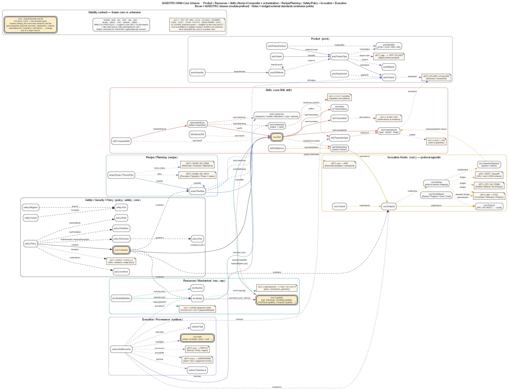

# 19 — HHM-Core Bridge (0.4.0)

This release absorbs the concepts and standards that the
*MAESTRO vs. HHM-Core* gap analysis flagged as missing or partial. Every
addition follows MAESTRO's bridge-axiom convention: an own namespace plus a
small `rdfs:subClassOf` / `rdfs:subPropertyOf` / `skos:exactMatch` to the
upstream vocabulary — no heavy upstream imports in the loaded stack (see
[04-standard-alignment.md](04-standard-alignment.md)).

## Priorities → MAESTRO modules

| HHM-Core priority | What was missing | Where it now lives | Standard bridged |
|---|---|---|---|
| **P1 Skill orchestration** | reified sub-skill links, control-flow, data bindings, typed parameters, neutral interface | `logical/skill.ttl` (`SubSkillLink`, `ControlFlow`, `DataBinding`, `ParameterDef`/`ParameterValue`, `Precondition`/`Effect`, `SkillInterface`/`SkillService`) | — (MAESTRO-local) |
| **P2 Recipe / plan** | neutral Recipe / ProcessPlan with steps realised by skills | `logical/recipe.ttl` (`Recipe`, `PlanStep`, …) | ISA-88 / IEC 61512 |
| **P3 Policy / access / modes** | Policy, Permission, Role, Mode, Evidence; reified Mitigation; Constraint→target | `cross-cutting/policy.ttl`, `safety:Mitigation`, `core:constrains` | ODRL 2.2 |
| **P4 Product identity** | type/instance split, variant, requirement, multi-scheme identifier, BOM node, passport | `logical/product.ttl`, `cross-cutting/dpp.ttl` | DPP / ECLASS |
| **P5 Execution provenance** | SkillExecution record, time interval, traceability | `runtime/runtime.ttl`, `execution/prov.ttl`, `execution/trace.ttl` | PROV-O, SAREF4INMA |
| **P6 Invocation completeness** | neutral Binding/Signature/EventStream, Module, topology, DTDL | `cross-cutting/communication.ttl`, `physical/resource.ttl` (`Module`), `physical/automationml.ttl`, `execution/dtdl.ttl` | CAEX / IEC 62714, DTDL |

## Schema overview

The figure below is a Graphviz class-relationship map of the HHM-Core surface —
the seven concern clusters (Product, Resources, Skills + orchestration,
Recipe/Planning, Safety/Policy, Invocation, Execution) with their MAESTRO classes
and the object properties between them. Boxes are MAESTRO classes (labelled with
the owning module prefix); the orange note shapes are the external standards each
cluster bridges via `rdfs:subClassOf` / `skos:exactMatch` (the extension points).
The **frozen `core:` classes** (the invariant spine) are drawn with a **gold
double border**; module classes use the normal fill and the `«EXT»` notes are
the always-external extension points — see the "Stability contract" legend on
the figure and [18-design-principles.md](18-design-principles.md#stability-contract--frozen-core-vs-extension).

Source: [`figures/src/14-maestro-core-schema.gv`](../figures/src/14-maestro-core-schema.gv)
— render with `dot -Tpng figures/src/14-maestro-core-schema.gv -o figures/png/14-maestro-core-schema.png`.

## Worked example

`examples/hhm-bridge/` instantiates every new module:

- `plant.ttl` (design-time) — a `res:Module` station with an AutomationML port,
  typed skill parameters + data binding + control flow, a two-step `recipe:Recipe`,
  a `prod:ProductType`/`Instance`/`Variant` with identifier, BOM and DPP, an
  ODRL-style policy with role/mode/evidence, a safety hazard/risk/mitigation, a
  neutral communication binding and a DTDL interface.
- `runtime.ttl` (snapshot) — a `runtime:SkillExecution` over a `TimeInterval`,
  consuming a `ParameterValue`, invoked via an endpoint, producing a SAREF4INMA
  `trace:Item` (and, via `execution/prov.ttl`, a `prov:Activity`).

## Validation

`python tests/validate_repo.py` → `MAESTRO validation passed`. New SHACL shapes
(`constraints/shapes-recipe.ttl`, `shapes-policy.ttl`, `shapes-product.ttl`, and
the SkillExecution / ParameterDef / SubSkillLink additions) are enforced over the
example data with RDFS inference.
