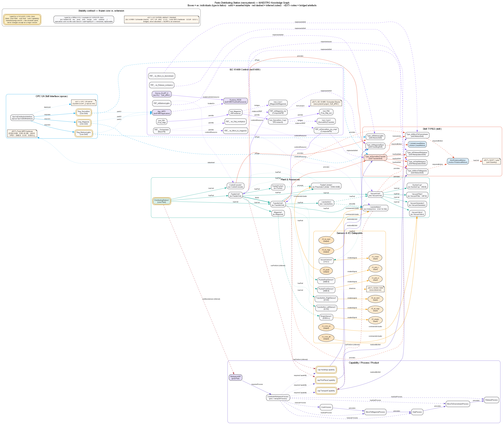
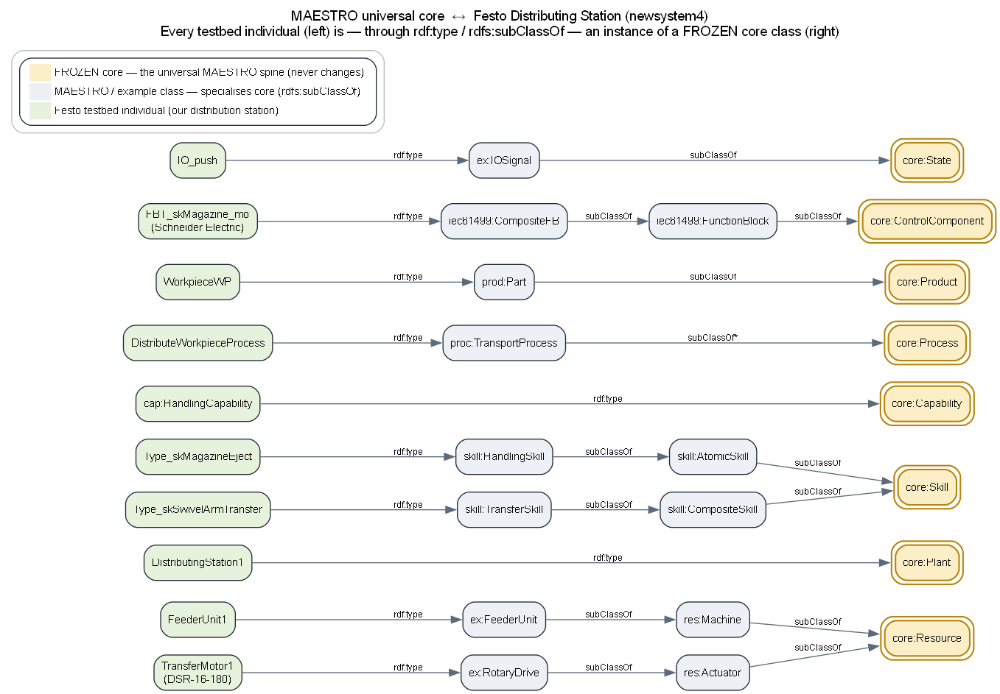

# Example — Festo Distributing Station (newsystem4)

A MAESTRO knowledge box for the Festo MPS **Distributing Station**, grounded in
two real artifacts:

- **Control layer** — the IEC 61499 / Schneider Electric project at
  `~/Documents/newsystem4/IEC61499` (device `Soft_dPAC` "EcoRT_0" / runtime `RES0`
  / application `APP1`).
- **Physical layer** — the Festo Didactic design documents
  (manual 648811, `01_Distributing_GRAFCET.pdf`, `Changer.pdf`) **and the
  stakeholder topology figures** (Picture1 = drawio, Picture2 = force-directed
  graph), which the physical / sensor / datapoint layer matches exactly.

A feeder unit ejects the bottom workpiece from a vertical FIFO magazine with a
pneumatic cylinder/pusher; a transfer unit (semi-rotary motor + arm carrying a
vacuum suction cup) grips it at the magazine, rotates 180°, and releases it at
the downstream station.

## Files

| File | Purpose |
|---|---|
| `plant.ttl` | Design-time: physical topology (real Festo parts) + sensors/IO + motion + skill TYPES + IEC 61499 FB layer + device/application/registered skills + OPC UA |
| `product.ttl` | Workpiece + the 5-step distribute process |
| `runtime.ttl` | Availability state snapshot (separate named graph) |

## Knowledge-graph overview

A clustered class-relationship map of the whole example (in the HHM-Core schema
style): every box is a real `ex:` individual and every edge a real triple from
`plant.ttl` / `product.ttl` / `runtime.ttl`, grouped by layer — Plant &
Resources, Sensors & I/O Datapoints, Skill TYPES, Capability/Process/Product,
IEC 61499 Control, and the OPC UA interface. Red dashed edges are inferred
(`canPerform` / `canManufacture`); the orange notes are bridged artefacts.
Individuals typed by a **frozen `core:` class** (`core:Plant`, `core:Skill`)
carry a **gold double border** — see the "Stability contract" legend and
[docs/18-design-principles.md](../../docs/18-design-principles.md#stability-contract--frozen-core-vs-extension)
for what never changes vs. what is always an extension.



Source: [`figures/src/15-distribution-newsystem4-schema.gv`](../../figures/src/15-distribution-newsystem4-schema.gv)
— render with `dot -Tpng figures/src/15-distribution-newsystem4-schema.gv -o figures/png/15-distribution-newsystem4-schema.png`.

## How this example relates to the MAESTRO core

MAESTRO is a *universal* ontology; this example is that universal core **applied
to the Festo testbed**. Every testbed individual is — through `rdf:type` +
`rdfs:subClassOf` — an instance of a frozen `core:` class. Nothing here invents a
new top-level concept; it only *specialises* the core:



For example `FeederUnit1 → ex:FeederUnit ⊑ res:Machine ⊑ core:Resource`, and the
Schneider Electric block `FBT_skMagazine_mo → iec61499:CompositeFB ⊑ core:ControlComponent`.
The same domain-agnostic rules in `rules/` then infer, over this testbed data,
that `DistributingStation1 core:canManufacture WorkpieceWP` — which is exactly
how MAESTRO is "used with" the testbed.

Source: [`figures/src/16-core-to-festo-bridge.gv`](../../figures/src/16-core-to-festo-bridge.gv).
The full class/property alignment, the reasoning demonstration and the
reproducibility scripts are written up in
[`CORE-ALIGNMENT.md`](CORE-ALIGNMENT.md).

## Plant topology (matches the figure)

```text
DistributingStation1
├── FeederUnit1            feeds → TransferUnit1
│     ├── Magazine1                (vertical FIFO, 8 WP; EmptySensor → empty)
│     ├── FeederPusher1            (drivenBy FeederCylinder1)
│     ├── FeederCylinder1          (DSNU-8-80)            ← push
│     ├── PusherFrontSensor1       (SME-8)  → pos_e
│     └── PusherRearSensor1        (SME-8)  → pos_r
├── TransferUnit1
│     ├── TransferMotor1           (DSR-16-180, 0–180°)   ← to_next, to_mgz
│     ├── TransferArm1             (drivenBy TransferMotor1; carries VacuumUnit1)
│     ├── VacuumUnit1
│     │     ├── VacuumValve1       (3/2-way)              ← vcm_on, vcm_off
│     │     ├── VacuumGenerator1 / VacuumFilter1 (VAF-8) / SuctionCup1 (VAS-8)
│     │     └── VacuumSensor1      (VPEV)   → vmon
│     ├── TransferArm_LeftSensor1  (S-3-E)  → at_mgz
│     └── TransferArm_RightSensor1 (S-3-E)  → at_next
└── ControlConsole1               (HMI — retained; not drawn in the figure)
```

**Datapoints** — inputs `pos_e, pos_r, empty, at_mgz, at_next, vmon`;
outputs (commands) `push, to_next, to_mgz, vcm_on, vcm_off`.

## Skills → Function Block Types → Resource

| Skill TYPE | FBT (newsystem4) | Controls resource |
|---|---|---|
| `ex:Type_skMagazineEject` | `skMagazine_mo` (logic `SkillMagazineController_b_a`) | `FeederUnit1` |
| `ex:Type_skMoveToMagazine` | `skSwivelArm_eo_Move_to_magazine` | `TransferMotor1` |
| `ex:Type_skMoveToDownstream` | `skSwivelArm_eo_Move_to_downstream` | `TransferMotor1` |
| `ex:Type_skGripWorkpiece` | `skSwivelArm_eo_Grip_workpiece` | `VacuumUnit1` |
| `ex:Type_skReleaseWorkpiece` | `skSwivelArm_eo_Release_workpiece` | `VacuumUnit1` |
| `ex:Type_skSwivelArmTransfer` (composite) | `skSwivelArm_mo_cmp1` (orchestrator `SkillSwivelArm1_Controller_Orchestrator`) | `TransferUnit1` |
| `ex:Type_skButtonsLights` | `skButtonsLights` | `ControlConsole1` |

The four elementary transfer-arm operations are sequenced by the orchestrator and
their outputs merged through `SwivelArmBus_4_1`. Sequential execution between the
feeder and the transfer arm is enforced by the **Permit** handshake
(`Perm_L`/`Perm_R`, modelled by `ex:permits`); `True_Adp` / `True_Adp_rev` grant
permission at the chain ends. Protocol adapters `Magazine2Magasine` and
`SwivelArm2Transfer` (`ex:bridges`) translate the internal signals to the
neighbour/downstream protocols. The three registered skills are exposed to the
network through `ex:OpcUaDistributionInterface`.

## Reasoning chain

```text
cap:PickPlaceCapability cap:realizedBySkill ex:Type_skSwivelArmTransfer
ex:Type_skSwivelArmTransfer a skill:TransferSkill
ex:Type_skSwivelArmTransfer ex:hasSubSkill ex:Type_skGripWorkpiece , ex:Type_skMoveToDownstream , …

ex:TransferUnit1 core:provides ex:Type_skSwivelArmTransfer
ex:FBT_skSwivelArm_mo_cmp1 iec61499:implementsSkill ex:Type_skSwivelArmTransfer
ex:FBT_skSwivelArm_mo_cmp1 iec61499:controlsResource ex:TransferUnit1

INFERRED: ex:TransferUnit1 core:canPerform cap:PickPlaceCapability
INFERRED: ex:DistributingStation1 core:canManufacture ex:WorkpieceWP
```

## Running

```python
from pathlib import Path
import rdflib

g = rdflib.Graph()
for path in Path("ontologies").glob("**/*.ttl"):
    g.parse(path, format="turtle")
g.parse("examples/distribution-station-newsystem4/plant.ttl", format="turtle")
g.parse("examples/distribution-station-newsystem4/product.ttl", format="turtle")

for triple in g.query(Path("rules/capability-inference.rq").read_text()):
    g.add(triple)

for row in g.query(Path("queries/01-resources-with-capability.rq").read_text()):
    print(row)
```

The repository-level regression check runs the same core path:

```bash
python tests/validate_repo.py
```
