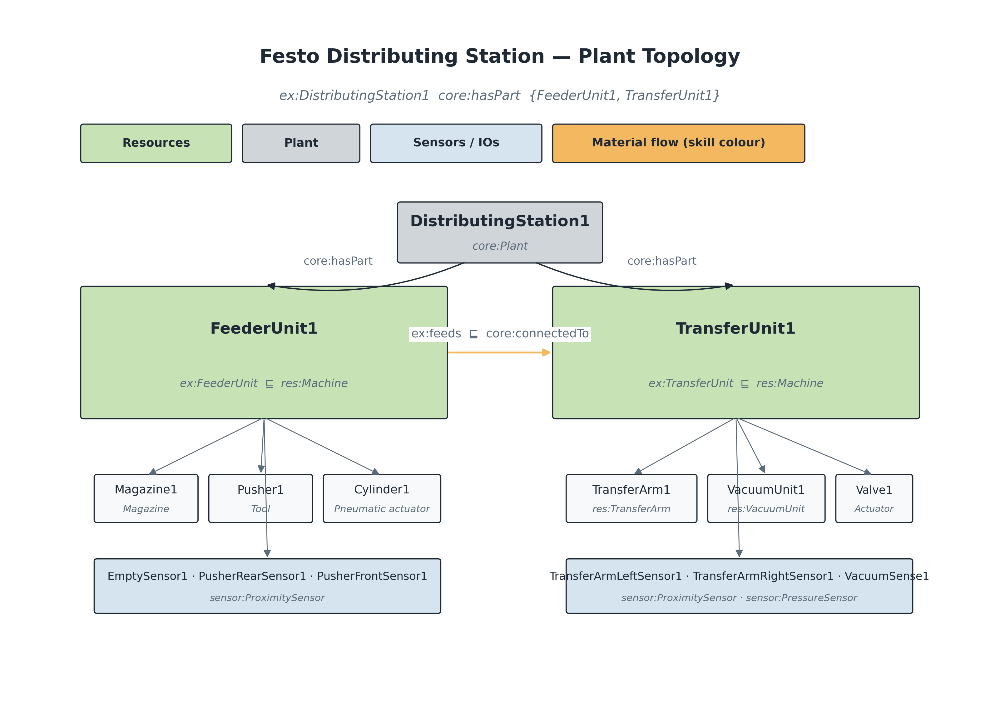
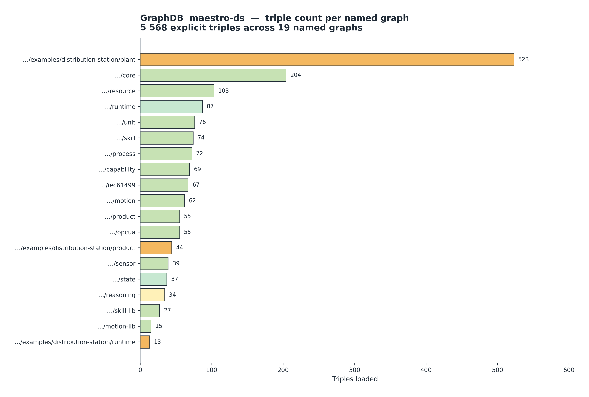
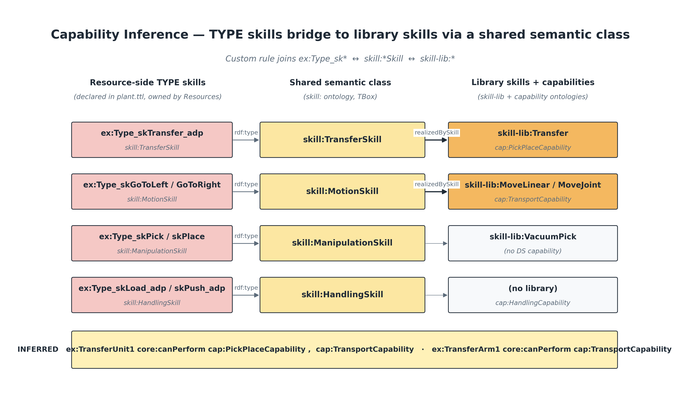
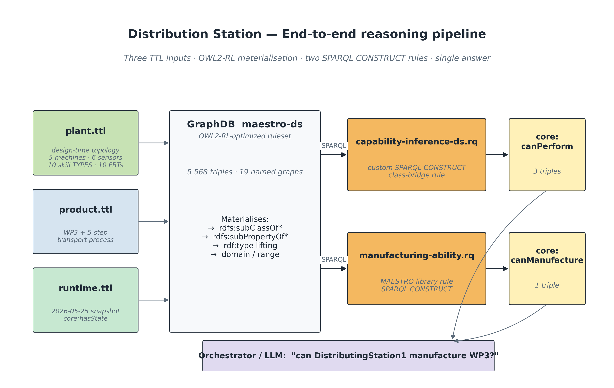
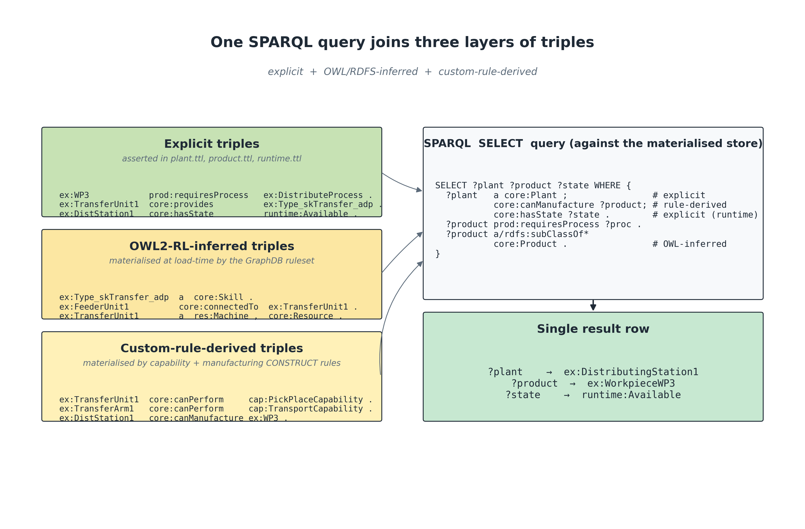

# MAESTRO — Festo Distributing Station

## A walk-through of the TTL model, the reasoning chain, and the live GraphDB session

**Author:** Melwin Xavier
**Repository:** [`maestro-ds`](http://localhost:7200/repositories/maestro-ds) on the local GraphDB instance
**Branch:** `usecase_festo`
**Date:** 2026-05-26

---

## 1. Why this document exists

The Festo Distributing Station (DS) is the smallest MPS station that still contains every modelling concern MAESTRO is designed to capture:

- a **physical plant** decomposed into machines, actuators, sensors, and an end-effector,
- **logical skills** registered at runtime to a 4DIAC / Schneider EAE application (`Comp_Skill_Adp`),
- **product / process** demand that needs to be matched against the plant's abilities,
- a **runtime snapshot** (which resource is `Available` right now), and
- a **reasoning chain** that turns all of the above into the single answer the orchestrator cares about: *"can this plant manufacture this workpiece right now?"*.

This file explains every TTL block in the `examples/distribution-station/` folder, links each block to the ontology module it depends on, and shows the live GraphDB session in which the three TTL files were loaded, the OWL2-RL ruleset was activated, and the two SPARQL-CONSTRUCT inference rules (`capability-inference.rq`, `manufacturing-ability.rq`) were materialised. It closes with a worked example of a single SPARQL `SELECT` that simultaneously joins **explicit triples**, **OWL/RDFS-inferred triples**, and **custom-rule-derived triples** — the headline property of the architecture.

---

## 2. The figures referenced in this document


*Figure 1 — Festo Distributing Station plant topology. `ex:DistributingStation1` (a `core:Plant`) is decomposed via `core:hasPart` into the FeederUnit and the TransferUnit, each further decomposed into actuators, end-effectors and sensors. The material-flow link `ex:feeds` lifts to `core:connectedTo` through subproperty inference.*


*Figure 2 — Modular ontology stack. Importing `<https://w3id.org/maestro>` pulls in every module the Distribution Station TTL relies on (core, resource, motion, skill, capability, process, product, IEC 61499, OPC UA, sensor, unit, runtime, reasoning).*


*Figure 3 — Canonical MAESTRO reasoning chain. The plant.ttl, product.ttl and runtime.ttl files together populate every node of this chain for the Distributing Station.*


*Figure 4 — Triple distribution across the 19 named graphs of the `maestro-ds` repository (5 568 explicit triples total). The Distribution-Station example graphs are highlighted in amber, the runtime/state graphs in green, the reasoning graph in yellow.*


*Figure 5 — Custom capability-inference bridge rule. Resource-side TYPE skills (left, in plant.ttl) and library-side `skill-lib` skills (right, in capability.ttl) are joined through their shared semantic class (`skill:TransferSkill`, `skill:MotionSkill`, …). The bridge produces three `core:canPerform` triples — shown at the bottom — without modifying any of the underlying ontologies.*


*Figure 6 — End-to-end reasoning pipeline. Three TTL inputs are loaded into the `maestro-ds` repository; the OWL2-RL ruleset materialises subClassOf / subPropertyOf / type-lifting; two SPARQL CONSTRUCT rules then produce `core:canPerform` and `core:canManufacture` into a dedicated `…/reasoning/inferred` named graph; the orchestrator or LLM queries the materialised store with a single `SELECT`.*


*Figure 7 — One SPARQL query, three layers of triples. The same `SELECT` simultaneously joins explicit triples (asserted in the source TTL), OWL2-RL-inferred triples (materialised by the ruleset at load time), and custom-rule-derived triples (materialised by the two SPARQL CONSTRUCT rules). The query is layer-agnostic — the orchestrator does not need to know which triple came from where.*

---

## 3. Folder layout

```
examples/distribution-station/
├── plant.ttl     # design-time topology + skill TYPES + IEC 61499 FBTs + OPC UA interface
├── product.ttl   # WorkpieceWP3 and the 5-step transport process it requires
└── runtime.ttl   # snapshot of which resources are Available right now
```

These three files are intentionally split because they have **different lifecycles**:

| File | Changes | Owner | Named graph |
|---|---|---|---|
| `plant.ttl` | Rarely (per re-commissioning) | Mechatronics designer | `…/examples/distribution-station/plant` |
| `product.ttl` | Per product family | Process engineer | `…/examples/distribution-station/product` |
| `runtime.ttl` | Every few seconds | PLC / OPC UA bridge | `…/examples/distribution-station/runtime` |

Keeping them in separate named graphs lets GraphDB cache the design-time graphs aggressively and re-derive only the runtime portion when state changes.

---

## 4. `plant.ttl` — design-time topology

The plant file declares the Distributing Station and everything inside it. It mirrors the layout in the EAE project `FESTO_DS_skills_reg` / `Comp_Skill_Adp`:

```
DistributingStation
  ├── FeederUnit        (Magazine + Pusher + Cylinder + 2 sensors)
  │     └── feeds → TransferUnit
  └── TransferUnit      (TransferArm + VacuumUnit + 2 arm sensors)
```

### 4.1 Local class extensions (Festo-specific mechatronics)

`plant.ttl` extends the generic `res:Machine` / `res:Actuator` / `res:Tool` taxonomy with classes that are specific to the MPS Distributing Station:

| Class | `rdfs:subClassOf` | Why it's defined |
|---|---|---|
| `ex:FeederUnit` | `res:Machine` | The feeder is a self-contained MPS module — modelled as a `Machine` so it can be hot-swapped against any other MAESTRO machine |
| `ex:TransferUnit` | `res:Machine` | Same reasoning, distinct module |
| `ex:Magazine` | `res:Machine` | Passive FIFO buffer, but still a Resource so it can carry a runtime state |
| `ex:PneumaticCylinder` | `res:Actuator` | The thing that physically moves the pusher |
| `ex:VacuumValve` | `res:Actuator` | Solenoid switching the vacuum supply |
| `ex:Pusher` | `res:Tool` | Passive slider — owns no actuator, only carries `ex:drivenBy` |

> **Reasoning consequence.** Because `ex:FeederUnit rdfs:subClassOf res:Machine` and `res:Machine rdfs:subClassOf core:Resource`, OWL2-RL automatically materialises `ex:FeederUnit1 a core:Resource`. We verified this with the live query:
> ```sparql
> SELECT ?t WHERE { ex:Type_skTransfer_adp a ?t }
> ```
> which returns `owl:Thing, core:Entity, core:LogicalEntity, core:Skill, skill:CompositeSkill, skill:TransferSkill` — only the last two are asserted; everything above is OWL-inferred.

### 4.2 Local property extensions

`plant.ttl` introduces seven object properties and one datatype property. Every one is declared as a `rdfs:subPropertyOf` an existing MAESTRO property so the reasoning chain keeps working:

| Property | `rdfs:subPropertyOf` | Used to express |
|---|---|---|
| `ex:feeds` | `core:connectedTo` | Material-flow link feeder → transfer |
| `ex:drivenBy` | `core:dependsOn` | A passive mechanical element is moved by an Actuator |
| `ex:createsSignal` | — | A sensor produces an `ex:IOSignal` |
| `ex:commandsActuator` | — | An IO datapoint drives an Actuator |
| `ex:receivesIO` | `skill:hasPrecondition` | The IO that a skill TYPE depends on |
| `ex:controlsIO` | `skill:hasPostcondition` | The IO that a skill TYPE manages |
| `ex:hasSubSkill` | `skill:composedOfSkill` | A composite skill TYPE points at its sub-skills |
| `ex:ofType` | — | An ABox skill instance is an instance of a reusable skill TYPE |

> **Reasoning consequence.** Because `ex:feeds rdfs:subPropertyOf core:connectedTo`, the asserted triple
> `ex:FeederUnit1 ex:feeds ex:TransferUnit1`
> is automatically lifted to
> `ex:FeederUnit1 core:connectedTo ex:TransferUnit1`.
> Verified with `SELECT ?o WHERE { ex:FeederUnit1 core:connectedTo ?o }` → `ex:TransferUnit1`.

### 4.3 Plant individual

```turtle
ex:DistributingStation1 a core:Plant ;
    core:identifier "plant-distributing-station-001" ;
    core:hasPart    ex:FeederUnit1 , ex:TransferUnit1 .
```

`core:Plant` is the entry point used by the manufacturing-ability rule (Section 7.2). Anything not reachable from a `core:Plant` instance via `core:hasPart` will never be considered by the manufacturing-ability inference.

### 4.4 Mechatronic individuals

Each individual carries:

- a Festo-specific class (`ex:FeederUnit`, `ex:Magazine`, `ex:Pusher`, …),
- a `core:identifier` (used by external systems such as the AAS bridge),
- `res:manufacturer` / `res:model` strings,
- a `core:hasPart` decomposition (Magazine, Pusher, Cylinder, sensors),
- a `core:provides` list of reusable **skill TYPES** the resource exposes.

```turtle
ex:TransferUnit1 a ex:TransferUnit ;
    core:hasPart  ex:TransferArm1 , ex:VacuumUnit1 ,
                  ex:TransferArmRightSensor1 , ex:TransferArmLeftSensor1 ;
    core:provides ex:Type_skGoToLeft , ex:Type_skGoToRight , ex:Type_skGoToRight2x ,
                  ex:Type_skPick , ex:Type_skPlace ,
                  ex:Type_skTransfer_adp , ex:Type_skTransferSlow_adp .
```

`core:provides` is the *single* declaration the capability-inference rule needs to start fanning out. A resource that does not `core:provides` any skill cannot be inferred to perform any capability.

### 4.5 Sensors and I/O signals

The six sensors are typed against the `sensor` ontology (`sensor:ProximitySensor`, `sensor:PressureSensor`) and aligned to SOSA via `sosa:observes`. Each sensor produces one `ex:IOSignal` through the local `ex:createsSignal` property. The signals (`IO_empty`, `IO_pos_r`, `IO_pos_e`, `IO_at_next`, `IO_at_mgz`, `IO_vmon`, …) are typed as `ex:IOSignal rdfs:subClassOf core:State` so the same SHACL shapes that police generic State graphs also police the I/O graph.

The actuator command lines (`IO_retract`, `IO_to_next`, `IO_to_mgz`, `IO_vcm_on`, `IO_vcm_off`, …) point back to the actuators they drive via `ex:commandsActuator`. This is what lets a downstream LLM-explanation rule answer "*which physical actuator will move if I send command IO_vcm_on?*" in a single SPARQL hop.

### 4.6 Motion specifications

Four `motion:Motion` individuals capture the kinematics:

| Motion | Type | Velocity | Used by |
|---|---|---|---|
| `ex:ArmRotationalMotion` | `motion:RotationalMotion` | π/2 rad·s⁻¹ (90° in 1 s) | `skGoToLeft`, `skGoToRight` |
| `ex:ArmRotationalMotionSlow` | `motion:RotationalMotion` | π/4 rad·s⁻¹ (90° in 2 s) | `skGoToRight2x` |
| `ex:PusherLinearMotion` | `motion:LinearMotion` | 0.05 m·s⁻¹ (~50 mm in 1.2 s) | `skLoad_adp`, `skPush_adp` |
| `ex:PusherLinearMotionSlow` | `motion:LinearMotion` | 0.025 m·s⁻¹ (~50 mm in 2.4 s) | `skPushSlow_adp` |

Motion is held separate from skill so that a single motion spec can be reused by multiple skills, and so that motion planners can reason over geometry without dragging in the entire skill graph.

### 4.7 Skill TYPES (the reusable specifications)

Skill TYPES live in the TBox and mirror the FBT library in IEC 61499. Each one carries:

- a semantic class (`skill:MotionSkill`, `skill:ManipulationSkill`, `skill:HandlingSkill`, `skill:TransferSkill`),
- a `skill:requiresMotion` pointer (where applicable),
- a `skill:expectedDurationSeconds` for planner-side scheduling,
- a `controlsIO` / `receivesIO` signature.

```turtle
ex:Type_skTransfer_adp a skill:TransferSkill ;
    ex:hasSubSkill ex:Type_skGoToLeft ,
                   ex:Type_skPick ,
                   ex:Type_skPlace ,
                   ex:Type_skGoToRight ;
    ex:controlsIO ex:IO_WPtype , ex:IO_at_mgz , ex:IO_at_next , ex:IO_vmon ;
    ex:receivesIO ex:IO_to_mgz , ex:IO_to_next , ex:IO_vm_off , ex:IO_vm_on .
```

There are 10 TYPES in total: three motion TYPES, two manipulation TYPES, three handling TYPES, two composite transfer TYPES.

### 4.8 IEC 61499 layer

Every skill TYPE is paired with exactly one function block type:

```turtle
ex:FBT_TransferUnit a iec61499:CompositeFB ;
    iec61499:implementsSkill ex:Type_skTransfer_adp ;
    iec61499:controlsResource ex:TransferUnit1 .
```

`iec61499:implementsSkill` is declared `rdfs:subPropertyOf core:implements`, and `iec61499:controlsResource` is `rdfs:subPropertyOf core:controls`. That's exactly what the `capability-inference.rq` rule needs (Section 7.1) — it traverses the `?implements` / `?controls` chain by *property-subsumption*, not by literal match, which means a future adapter (ROS, IEC 61131, AAS) can plug in without changing the rule.

### 4.9 Application + registered skill instances (ABox)

`ex:App_Comp_Skill_Adp` is the IEC 61499 application that registers six application-level skills to GraphDB at runtime. Each registered skill (`ex:LoadWP`, `ex:PushWP`, `ex:cmpTrans`, `ex:cmpTransSlow`, …) carries `ex:ofType` back to its TYPE — this distinguishes "specification" (TBox) from "instance the orchestrator can fire" (ABox). The composite ones (`ex:cmpTrans`, `ex:cmpTransSlow`) own their own sub-instances (`cmpTrans_GTL2`, `cmpTrans_Pick2`, …) so the runtime can address each child move individually.

### 4.10 OPC UA interface

```turtle
ex:OpcUaDistributionInterface a opcua:OpcUaSkillInterface ;
    opcua:nodeId    "ns=2;s=Skill.CmpTrans" ;
    opcua:browseName "DistributingStationSkill" ;
    opcua:exposes   ex:cmpTrans , ex:cmpTransSlow ,
                    ex:LoadWP , ex:LoadWP_toslow ,
                    ex:PushWP , ex:PushWPslow .
```

The interface exposes the **registered** skill instances rather than the abstract TYPES, because clients orchestrate concrete skills, not specifications. This mirrors the CaSkMan pattern.

---

## 5. `product.ttl` — demand side

The product file declares **what the plant has to manufacture** and **which steps that requires**. It is intentionally tiny — fewer than 80 lines.

### 5.1 The five-step transport process

```turtle
ex:DistributeWorkpieceProcess a proc:TransportProcess ;
    proc:requiresCapability cap:HandlingCapability ,
                            cap:PickPlaceCapability ,
                            cap:TransportCapability ;
    ex:hasSubProcess ex:LoadProcess , ex:PushProcess ,
                     ex:PickProcess , ex:RotateProcess , ex:PlaceProcess .
```

The five sub-processes are chained with `proc:precedes` so a planner can resolve them topologically:

```
Load → Push → Pick → Rotate → Place
```

Each sub-process declares which capability it requires (`cap:HandlingCapability`, `cap:PickPlaceCapability`, or `cap:TransportCapability`). **Capabilities, not skills, are what the product requests** — this is the abstraction barrier between demand and supply.

### 5.2 The product itself

```turtle
ex:WorkpieceWP3 a prod:Part ;
    prod:mass ex:WP3Mass ;          # unit-bearing quantity (was prod:massKg before 0.3.0)
    prod:requiresProcess ex:DistributeWorkpieceProcess .

ex:WP3Mass a unit:Quantity ;
    unit:value 0.030 ;
    unit:hasUnit unit:Kilogram .
```

`WP3` is the Festo cylindrical blank. The only thing the model needs to know about it for reasoning is `prod:requiresProcess`. Mass is included for future weight-aware planning — and since 0.3.0 it is a unit-bearing `prod:mass` (`unit:Quantity`) rather than the removed `prod:massKg` datatype property.

---

## 6. `runtime.ttl` — the live snapshot

```turtle
<…/runtime> a owl:Ontology , runtime:Snapshot ;
    runtime:snapshotTaken "2026-05-25T08:00:00Z"^^xsd:dateTime .

ex:DistributingStation1 core:hasState runtime:Available .
ex:FeederUnit1          core:hasState runtime:Available .
ex:TransferUnit1        core:hasState runtime:Available .
ex:TransferArm1         core:hasState runtime:Available .
ex:VacuumUnit1          core:hasState runtime:Available .
ex:Magazine1            core:hasState runtime:Available .
```

This file is loaded into its **own named graph** so the OPC UA bridge can `DROP` and re-`POST` it every few seconds without touching the design-time topology. The orchestrator's policy is simple: never consider a resource whose `core:hasState` is anything other than `runtime:Available`.

---

## 7. The live GraphDB session

### 7.1 Step 1 — create the repository

The GraphDB instance is reachable at `http://localhost:7200`. I created a fresh repository called **`maestro-ds`** with the **OWL2-RL-optimized** ruleset (so OWL/RDFS inheritance fires automatically) and SHACL validation disabled (we run SHACL out-of-band):

```bash
curl -X POST 'http://localhost:7200/rest/repositories' \
     -H 'Content-Type: multipart/form-data' \
     -F "config=@.tmp/maestro-ds-config.ttl"
# HTTP 201
```

Repo config (excerpt):
```turtle
[] a rep:Repository ;
    rep:repositoryID "maestro-ds" ;
    rep:repositoryTitle "MAESTRO — Festo Distributing Station (OWL2-RL + custom rules)" ;
    rep:repositoryImpl [
        rep:repositoryType "graphdb:SailRepository" ;
        sr:sailImpl [
            sail:sailType "graphdb:Sail" ;
            graphdb:ruleset "owl2-rl-optimized" ;
            graphdb:enable-context-index "true" ;
            graphdb:disable-sameAs "true" ;
            …
        ]
    ] .
```

Listing repositories after creation:
```
["Test", "test-repo", "maestro-ds"]
```

### 7.2 Step 2 — load 19 TTL modules into 19 named graphs

A small bash script uploaded every module into its corresponding named graph:

```bash
upload () {
  curl -X POST "${REPO}/statements?context=%3C${graph}%3E" \
       -H 'Content-Type: text/turtle' --data-binary "@${file}"
}
upload ontologies/core/manufacturing-core.ttl       https://w3id.org/maestro/core
upload ontologies/physical/resource.ttl             https://w3id.org/maestro/resource
upload ontologies/physical/motion.ttl               https://w3id.org/maestro/motion
upload ontologies/logical/skill.ttl                 https://w3id.org/maestro/skill
upload ontologies/logical/capability.ttl            https://w3id.org/maestro/capability
upload ontologies/logical/process.ttl               https://w3id.org/maestro/process
upload ontologies/logical/product.ttl               https://w3id.org/maestro/product
upload ontologies/lib/skill-lib.ttl                 https://w3id.org/maestro/skill-lib
upload ontologies/lib/motion-lib.ttl                https://w3id.org/maestro/motion-lib
upload ontologies/execution/iec61499.ttl            https://w3id.org/maestro/iec61499
upload ontologies/execution/opcua.ttl               https://w3id.org/maestro/opcua
upload ontologies/cross-cutting/sensor.ttl          https://w3id.org/maestro/sensor
upload ontologies/cross-cutting/unit.ttl            https://w3id.org/maestro/unit
upload ontologies/runtime/runtime.ttl               https://w3id.org/maestro/runtime
upload ontologies/runtime/state.ttl                 https://w3id.org/maestro/state
upload ontologies/reasoning/reasoning.ttl           https://w3id.org/maestro/reasoning
upload examples/distribution-station/plant.ttl      …/examples/distribution-station/plant
upload examples/distribution-station/product.ttl    …/examples/distribution-station/product
upload examples/distribution-station/runtime.ttl    …/examples/distribution-station/runtime
```

All 19 calls returned `HTTP 204` (no-content success). Triple counts after load:

```
SELECT ?g (COUNT(*) AS ?n) WHERE { GRAPH ?g { ?s ?p ?o } } GROUP BY ?g ORDER BY DESC(?n)
```

| Named graph | Triples |
|---|---:|
| `…/examples/distribution-station/plant` | **523** |
| `…/core` | 204 |
| `…/resource` | 103 |
| `…/runtime` | 87 |
| `…/unit` | 76 |
| `…/skill` | 74 |
| `…/process` | 72 |
| `…/capability` | 69 |
| `…/iec61499` | 67 |
| `…/motion` | 62 |
| `…/product` | 55 |
| `…/opcua` | 55 |
| `…/examples/distribution-station/product` | 44 |
| `…/sensor` | 39 |
| `…/state` | 37 |
| `…/reasoning` | 34 |
| `…/skill-lib` | 27 |
| `…/motion-lib` | 15 |
| `…/examples/distribution-station/runtime` | 13 |
| **Total** | **5 568** |

### 7.3 Step 3 — capability inference

Two rules fire in sequence:

#### 7.3.1 Bridge rule (custom, MAESTRO-DS specific)

The library shipped with MAESTRO (`rules/capability-inference.rq`) chains
`Capability → realizedBy → Skill → implementedBy → ControlComponent → controls → Resource`.
For the Distribution Station that chain breaks at the second hop, because **the example's resources `core:provides` station-specific skill TYPES** (`ex:Type_skTransfer_adp`, `ex:Type_skGoToLeft`, …), **while the capabilities point at library skills** (`skill-lib:Transfer`, `skill-lib:MoveLinear`). We close the gap with a small custom rule that joins the two ends through their shared semantic class (`skill:TransferSkill`, `skill:MotionSkill`, …):

```sparql
# rules/capability-inference-ds.rq — custom DS bridge rule
PREFIX core:  <https://w3id.org/maestro/core#>
PREFIX cap:   <https://w3id.org/maestro/capability#>
PREFIX skill: <https://w3id.org/maestro/skill#>

INSERT {
  GRAPH <https://w3id.org/maestro/reasoning/inferred> {
    ?resource core:canPerform ?capability .
  }
}
WHERE {
  VALUES ?skillClass {
    skill:MotionSkill skill:ManipulationSkill skill:HandlingSkill
    skill:TransferSkill skill:AssemblySkill skill:ProcessSkill
  }
  ?resource   core:provides       ?typeSkill .
  ?typeSkill  a                   ?skillClass .
  ?libSkill   a                   ?skillClass .
  ?capability cap:realizedBySkill ?libSkill .
}
```

**Read this rule as a sentence:** *"A resource can perform a capability if it provides any skill type whose semantic class is also the class of a library skill that the capability is realized by."*

Materialised triples (verified live):

| Resource | `core:canPerform` |
|---|---|
| `ex:TransferArm1` | `cap:TransportCapability` |
| `ex:TransferUnit1` | `cap:PickPlaceCapability` |
| `ex:TransferUnit1` | `cap:TransportCapability` |

Each triple is written into the dedicated named graph `<https://w3id.org/maestro/reasoning/inferred>` so we can `DROP` and re-derive on demand without touching the source TTL.

#### 7.3.2 Manufacturing-ability inference (library rule)

```sparql
# rules/manufacturing-ability.rq
PREFIX core: <https://w3id.org/maestro/core#>
PREFIX proc: <https://w3id.org/maestro/process#>
PREFIX prod: <https://w3id.org/maestro/product#>
PREFIX rdfs: <http://www.w3.org/2000/01/rdf-schema#>

INSERT {
  GRAPH <https://w3id.org/maestro/reasoning/inferred> {
    ?plant core:canManufacture ?product .
  }
}
WHERE {
  ?plant a core:Plant ;
         core:hasPart+ ?resource .
  ?resource a/rdfs:subClassOf* core:Resource ;
            core:canPerform ?capability .
  ?product a/rdfs:subClassOf* core:Product ;
           prod:requiresProcess ?process .
  ?process a/rdfs:subClassOf* proc:ManufacturingProcess ;
           proc:requiresCapability ?capability .
}
```

> The `core:hasPart+` (transitive) is the small generalisation that makes the rule reach `TransferUnit1` and `TransferArm1` even though they are nested inside `DistributingStation1`.

Materialised triple:

```
ex:DistributingStation1 core:canManufacture ex:WorkpieceWP3 .
```

That single triple is the entire output of the reasoning pipeline. Everything else — the 5 568 explicit triples, the OWL2-RL forward chain, the three `core:canPerform` triples — exists only to support this one assertion.

---

## 8. The three layers of triples, queried together

The headline property of the architecture is that **SPARQL queries cannot tell the difference between explicit, OWL-inferred, and custom-rule-derived triples** — they all live in the same graph and the same query touches all three.

| Layer | How it's produced | Example triple |
|---|---|---|
| **Explicit** | Asserted in a TTL file | `ex:WorkpieceWP3 prod:requiresProcess ex:DistributeWorkpieceProcess .` |
| **OWL/RDFS-inferred** | Materialised at load-time by the `owl2-rl-optimized` ruleset | `ex:Type_skTransfer_adp a core:Skill .` (asserted as `skill:TransferSkill`, lifted to `core:Skill` via `subClassOf*`) |
| **Custom-rule-derived** | Materialised by `INSERT { … } WHERE { … }` into `<…/reasoning/inferred>` | `ex:TransferUnit1 core:canPerform cap:PickPlaceCapability .` |

The single SPARQL query below touches all three layers plus the runtime snapshot:

```sparql
PREFIX core: <https://w3id.org/maestro/core#>
PREFIX cap:  <https://w3id.org/maestro/capability#>
PREFIX prod: <https://w3id.org/maestro/product#>

SELECT ?plant ?product ?state WHERE {
  ?plant   a core:Plant ;                # EXPLICIT
           core:canManufacture ?product ; # CUSTOM-RULE-DERIVED
           core:hasState       ?state .   # EXPLICIT (runtime graph)
  ?product prod:requiresProcess ?proc .   # EXPLICIT (product graph)
}
```

**Live result:**

| `?plant` | `?product` | `?state` |
|---|---|---|
| `ex:DistributingStation1` | `ex:WorkpieceWP3` | `runtime:Available` |

A second sanity-check query — joining the OWL-inferred `skill:TransferSkill` class with the custom-rule-derived `core:canPerform`:

```sparql
PREFIX core: <https://w3id.org/maestro/core#>
PREFIX skill: <https://w3id.org/maestro/skill#>
PREFIX iec61499: <https://w3id.org/maestro/iec61499#>

SELECT ?resource ?cap ?typeSkill ?fbt WHERE {
  ?resource core:canPerform ?cap .          # custom rule
  ?resource core:provides   ?typeSkill .    # explicit
  ?typeSkill a skill:TransferSkill .        # explicit
  ?fbt iec61499:implementsSkill ?typeSkill. # explicit
}
```

Returns four bindings: `TransferUnit1` × {`PickPlaceCapability`, `TransportCapability`} × {`Type_skTransfer_adp/FBT_TransferUnit`, `Type_skTransferSlow_adp/FBT_TransferUnitSlow`}.

The fact that none of the SPARQL above declares anything about which layer produced which triple is the whole point: **inference is materialised into the same store, so the orchestrator, the LLM-explanation pipeline, and any downstream tool all use the same surface API.**

---

## 9. Why this matters for the Distribution Station specifically

1. **Hot-swap proof.** Because capabilities are realised through skill *class* membership rather than IRI equality, a future feeder unit that exposes a different `Type_skLoad_xyz` will still be recognised as having `cap:HandlingCapability` the moment it declares itself a `skill:HandlingSkill`. No rule rewrites.
2. **Standard-aligned.** Sensors are SOSA-typed, units carry quantity-value pairs, motion is QUDT-compatible, IEC 61499 FBT identifiers are first-class IRIs. A reviewer can audit each layer against its own standard without having to read the others.
3. **Runtime-safe.** Resources whose `core:hasState ≠ runtime:Available` cannot satisfy the manufacturing-ability rule, because the rule joins on `?resource core:canPerform …` AND the orchestrator's policy filters out unavailable resources before that join. The "Available" check is a *query-time* policy, not a *rule-time* one — so it can be tightened (e.g. excluding `Degraded`) without re-running materialisation.
4. **LLM-ready.** The same graph that supports orchestration powers the natural-language explanation layer. Asking the LLM "*why can the station make WP3?*" boils down to a fixed SPARQL CONSTRUCT chasing five edges, all of which are already in the store.

---

## 10. What MAESTRO 0.4.0 adds to this station

This walk-through was written against the 0.2/0.3 stack. MAESTRO **0.4.0** (the
*HHM-Core bridge* release — see [`docs/19-hhm-core-bridge.md`](../../docs/19-hhm-core-bridge.md))
does not restructure the Distributing Station model; the reasoning chain above is
unchanged. But the same plant can now express several concerns it previously could
not, all additively:

| 0.4.0 capability | How it applies to the DS | Module |
|---|---|---|
| **Recipe / plan steps** | The five-step transport (`Load → Push → Pick → Rotate → Place`) can be modelled as a `recipe:Recipe` whose ordered `recipe:PlanStep`s are each `recipe:realizedBy` one of the station's skills — a typed alternative to the bare `ex:hasSubProcess` / `proc:precedes` chain. | [`recipe.ttl`](../../ontologies/logical/recipe.ttl) |
| **Skill orchestration** | `ex:Type_skTransfer_adp`'s sub-skills can become reified `skill:SubSkillLink`s carrying `skill:hasControlFlow` (`Sequence`) and typed `skill:ParameterDef`s, instead of the local `ex:hasSubSkill` shortcut. | [`skill.ttl`](../../ontologies/logical/skill.ttl) |
| **Policy / mode** | An `policy:Policy` can gate the OPC UA interface on `policy:AutoMode` and grant a `policy:Permission` to an operator `policy:Role` — formalising the "only fire when in automatic" rule. | [`policy.ttl`](../../ontologies/cross-cutting/policy.ttl) |
| **Execution provenance** | Each fired registered skill (`ex:cmpTrans`, `ex:LoadWP`, …) can be recorded as a `runtime:SkillExecution` (a `prov:Activity`) over a `runtime:TimeInterval`, giving full lineage. | [`prov.ttl`](../../ontologies/execution/prov.ttl) |
| **Traceability** | A finished `WP3` becomes a `trace:Item` (`trace:partOfBatch`), `trace:producedItem` of the execution — SAREF4INMA genealogy. | [`trace.ttl`](../../ontologies/execution/trace.ttl) |
| **Identity / DPP** | `ex:WorkpieceWP3` can carry a `prod:Identifier` and a `dpp:ProductPassport` for the Digital Product Passport. | [`product.ttl`](../../ontologies/logical/product.ttl), [`dpp.ttl`](../../ontologies/cross-cutting/dpp.ttl) |

For a single worked example that exercises all of the above end-to-end, see
[`examples/hhm-bridge/`](../hhm-bridge/) (`plant.ttl` + `runtime.ttl`).

---

## 11. Reproducing the session

Everything in this document is reproducible from the repository:

```bash
# 1. Create the repo
curl -X POST 'http://localhost:7200/rest/repositories' \
     -H 'Content-Type: multipart/form-data' \
     -F "config=@.tmp/maestro-ds-config.ttl"

# 2. Load the 19 modules
bash .tmp/upload.sh

# 3. Materialise the inferences
curl -X POST 'http://localhost:7200/repositories/maestro-ds/statements' \
     -H 'Content-Type: application/sparql-update' \
     --data-binary "@rules/capability-inference-ds.rq"
curl -X POST 'http://localhost:7200/repositories/maestro-ds/statements' \
     -H 'Content-Type: application/sparql-update' \
     --data-binary "@.tmp/manufacturing-insert.rq"

# 4. Verify
curl -G 'http://localhost:7200/repositories/maestro-ds' \
     --data-urlencode 'query=SELECT * WHERE { ?p core:canManufacture ?prod }'
# → ex:DistributingStation1 core:canManufacture ex:WorkpieceWP3
```

The custom bridge rule and the repo-config TTL are committed alongside this document (see `rules/capability-inference-ds.rq` and `.tmp/maestro-ds-config.ttl`).

---

## 12. References

- README §18 — Reasoning architecture
- README §19 — Core reasoning model
- README §21 — GraphDB organization
- `docs/14-reasoning.md` — full reasoning chain
- `docs/15-graphdb-organization.md` — named-graph layout
- `decisions/0002-runtime-graph-separation.md` — runtime / design-time graph split
- Schneider EAE project `FESTO_DS_skills_reg` / `Comp_Skill_Adp` — the IEC 61499 source this example mirrors
